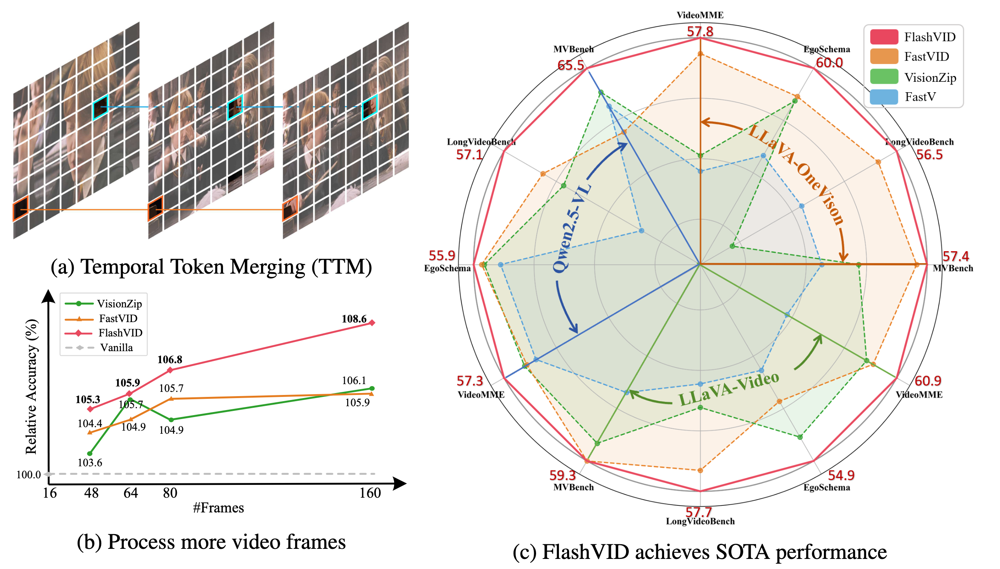
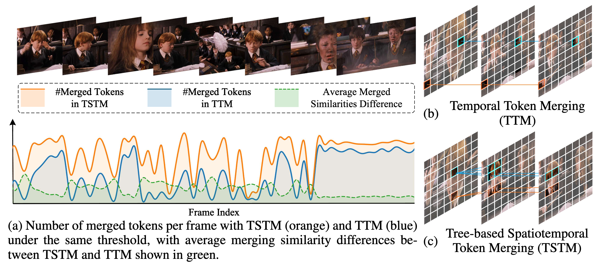
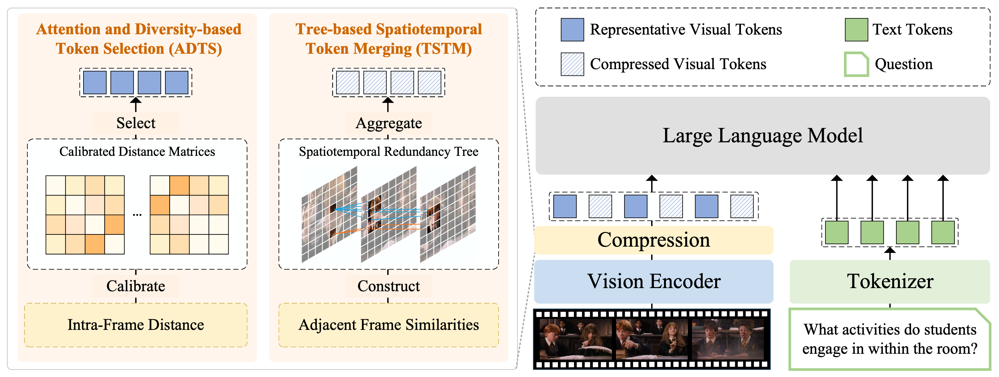

# FlashVID: Efficient Video Large Language Models via Training-free Tree-based Spatiotemporal Token Merging

<div align="center">
<a href="https://github.com/Fanziyang-v">Ziyang Fan</a><sup>1</sup>,&nbsp; <a href="https://github.com/Mirei124">Keyu Chen</a><sup>1</sup>,&nbsp; <a href="https://github.com/xrlexpert">Ruilong Xing</a><sup>1</sup>,&nbsp; <a href="https://github.com/yu-lin-li">Yulin Li</a><sup>1</sup>,&nbsp; <a href="https://github.com/llijiang">Li Jiang</a><sup>2,3</sup>,&nbsp; <a href="https://github.com/tianzhuotao">Zhuotao Tian</a><sup>1,3*</sup>&nbsp;
<br>
<sup>1</sup> Harbin Institute of Technology (Shenzhen) &nbsp;&nbsp;&nbsp; <sup>2</sup> The Chinese University of Hong Kong (Shenzhen)<br> <sup>3</sup> Shenzhen Loop Area Institute
<br>
<sup>*</sup>Corresponding Author
<br>
<a href='https://iclr.cc/'></a> &nbsp;
<a href='https://openreview.net/forum?id=H6rDX4w6Al'></a> &nbsp;
<a href="LICENSE"></a> &nbsp;
<a href='https://fanziyang-v.github.io/FlashVID/'></a> &nbsp;
<a href="https://arxiv.org/abs/2602.08024"></a> &nbsp;
<a href="https://huggingface.co/"></a> &nbsp;
<!-- <a href="https://python.org/"></a> &nbsp; -->
<!-- <a href="https://pytorch.org/"></a> &nbsp; -->
<!-- <a href="#"></a> &nbsp; -->
</div>

## 🔖Table of Contents

1. [News](#news)
2. [Todo List](#todo-list)
3. [Highlights](#highlights)
4. [Motivation](#motivation)
5. [Method](#method)
6. [Installation](#installation)
7. [Quickstart](#quickstart)
8. [Evaluation](#evaluation)
9. [Acknowledgement](#acknowledgement)
10. [Citation](#citation)

## 🔥News

- [2026.02.10] 🚀Release our paper on arXiv.
- [2026.02.06] 🍾Our paper has been selected as an **Oral Presentation** at **ICLR 2026**.
- [2026.02.01] ✨Release FlashVID code and inference demos on *Qwen2.5-VL* and *Qwen3-VL*.
- [2026.01.31] 🚀Release this repository to the public.
- [2026.01.30] ✨Release FlashVID code and inference demos on *LLaVA-OneVision* and *LLaVA-Video*.
- [2026.01.30] 👏Initialize this GitHub repository.
- [2026.01.26] 🎉Our training-free inference acceleration method [FlashVID](https://openreview.net/forum?id=H6rDX4w6Al) has been accepted at **ICLR 2026**.
- [2025.12.06] 🌟Release the GitHub repository of [DyTok](https://github.com/yu-lin-li/DyToK).
- [2025.09.18] 🎉 Our training-free inference acceleration framework [DyTok](https://www.arxiv.org/abs/2512.06866) has been accepted at **NeurIPS 2025**.

## 📋Todo List

- [ ] Optimize code efficiency
- [x] Release FlashVID code on LLaVA-OneVision and LLaVA-Video.
- [x] Release inference demos on different Video LLMs with FlashVID.
- [x] Support evaluation using [LMMs-Eval](https://github.com/EvolvingLMMs-Lab/lmms-eval).
- [x] Release FlashVID code on Qwen2.5-VL and Qwen3-VL.
- [x] Release our paper on arXiv.

## ✨Highlights



1. Our FlashVID significantly outperforms previous state-of-the-art acceleration frameworks (e.g., VisionZip, FastVID) across **three** representative VLLMs (i.e., LLaVA-OneVision, LLaVA-Video, Qwen2.5-VL) on **five** widely used video understanding benchmarks (i.e., VideoMME, EgoSchema, LongVideoBench, MVBench, MLVU).
2. FlashVID can serve as a training-free and plug-and-play module for extending long video frames, enabling a **10x** increase in video frame input to Qwen2.5-VL, resulting in **8.6%** within the same computational budget.
3. Existing efficient Video LLM methods often independently compress spatial and temporal redundancy, overlooking the intrinsic spatiotemporal relationships in videos. To address this, we present a **simple yet effective** solution: Tree-based Spatiotemporal Token Merging (TSTM) for fine-grained spatiotemporal redundancy compression.

## 💡Motivation



In this work, we identify two key observations about spatiotemporal redundancy in videos:

1. **Temporal redundancy is not bound to fixed spatial locations.** Semantically consistent elements in videos often shift in spatial position, scale, or appearance due to motion and scene dynamics, making rigid spatial correspondence across frames unreliable
2. **Spatial and temporal redundancy are inherently coupled.** Redundant regions within a single frame frequently persist across multiple frames. Decoupled spatiotemporal redundancy compression overlooks the intrinsic spatiotemporal relationships, leading to suboptimal compression.

To achieve better spatiotemporal redundancy compression, we present a **simple yet effective** solution: **Tree-based Spatiotemporal Token Merging (TSTM)** for fine-grained spatiotemporal redundancy compression, complemented by the **Attention and Diversity-based Token Selection (ADTS)** module for informative token selection.

## 🌈Method



**Illustration of FlashVID**. We compress visual tokens by two synergistic modules.

1. **Attention and Diversity-based Token Selection (ADTS)** prioritizes spatiotemporally informative tokens while ensuring feature diversity by solving a calibrated Max-Min Diversity Problem (MMDP);
2. **Tree-based Saptiotemporal Token Merging (TSTM)** models redundancy by spatiotemporal redundancy trees, which effectively capture fine-grained video dynamics. Each redundancy tree will be aggregated into a single token representation.


## 📦Installation

In this project, we use [uv](https://github.com/astral-sh/uv) for package management.

1. **Clone this repository and navigate to the FlashVID folder:**

```bash
git clone https://github.com/Fanziyang-v/FlashVID.git
cd FlashVID
```

2. **Install the inference package:**

```bash
uv sync
```

## 🚀Quickstart

FlashVID's code is easy to use and works out of the box. Just wrap the model with the `flashvid()` function. Currently, FlashVID supports LLaVA-OneVision, LLaVA-Video, Qwen2.5-VL, and Qwen3-VL.

```python
from flashvid import flashvid

model = flashvid(
    model,
    retention_ratio=0.1,
    alpha=0.7,
    temporal_threshold=0.8,
)
```

📝**Note**: You can override the default parameters (e.g., retention ratio) in the `flashvid()` wrapper function.

Inference demos are provided in `playground/`. Here is an running example:

```bash
python playground/llava_ov_infer.py \
    --video-path assets/Qgr4dcsY-60.mp4 \
    --question "Describe the video in detail." \
    --num-frames 32 \
    --enable-flashvid
```

## 📊Evaluation

In this project, all the experiments are conducted using [LMMs-Eval](https://github.com/EvolvingLMMs-Lab/lmms-eval). We provide FlashVID evaluation scripts in `scripts/`, including LLaVA-OneVision, LLaVA-Video, Qwen2.5-VL, and Qwen3-VL. You can run the scripts to reproduce our experimental results:

```bash
bash scripts/llava_ov.sh
```

📝**Note**: It is extremely easy to integrate FlashVID into LMMs-Eval by adding specific parameters in `__init__()` and wrapping the loaded model with the `flashvid()` function. (See `lmms_eval/models/simple/llava_onevision.py`)

## 👏Acknowledgement

This project is built upon recent open-source works: [FastV](https://github.com/pkunlp-icler/FastV), [VisionZip](https://github.com/dvlab-research/VisionZip), [PruneVID](https://github.com/visual-ai/prunevid), [FastVID](https://github.com/LunarShen/FastVID), [LLaVA-NeXT](https://github.com/LLaVA-VL/LLaVA-NeXT), [Qwen2.5-VL/Qwen3-VL](https://github.com/QwenLM/Qwen3-VL), [LMMs-Eval](https://github.com/EvolvingLMMs-Lab/lmms-eval). Thanks for their excellent work!

## 📜Citation

If you find this project useful in your research, please consider citing:

```bib
@inproceedings{fan2026flashvid,
  title={FlashVID: Efficient Video Large Language Models via Training-free Tree-based Spatiotemporal Token Merging},
  author={Fan, Ziyang and Chen, Keyu and Xing, Ruilong and Li, Yulin and Jiang, Li and Tian, Zhuotao},
  booktitle={Proceedings of the 14th International Conference on Learning Representations},
  year={2026}
}
```

## ⭐️Star History

[](https://star-history.com/#Fanziyang-v/FlashVID&Date)
