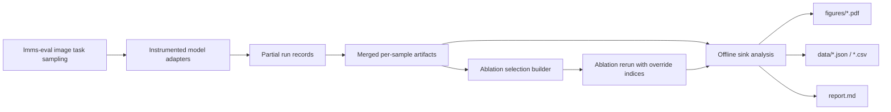

# Sink Analysis Design

## Summary

This design adds an end-to-end single-image sink-analysis pipeline for the local FlashVID workspace. The pipeline is built to stay maximally compatible with the current local `lmms-eval` integration and existing model adapters, while minimizing invasive changes to model code.

The implementation targets two image-capable model lines already present and runnable in this repository:

- `LLaVA-OneVision-7B`
- `Qwen3-VL-8B`

The sink-analysis pipeline must support the full causal story the experiment needs:

1. sink tokens exist
2. attention-based selection retains sinks
3. FETP suppresses sinks
4. suppressing sinks improves downstream behavior

The implementation must provide one resumable top-level workflow that can run the entire chain:

- full baseline collection
- FETP collection
- attention-only collection
- MMTok collection
- artifact merge
- ablation selection construction
- ablation reruns for `Attention-Sink` and `FETP+Sink`
- offline plots, summary files, and `report.md`

The default execution mode is a small local smoke run on a few image-task samples, but the same code path must scale to the full paper-sized run later without redesign.

## Goals

- Reuse the current local `lmms-eval` task, prompt, `doc_id`, `target`, and `log_samples` behavior instead of introducing a parallel evaluation stack
- Keep model changes thin by adding export and override hooks only where they are strictly needed
- Add a unified artifact format that can represent both models and all three selection methods
- Support `LLaVA-OneVision-7B` and `Qwen3-VL-8B` under one analysis pipeline
- Produce all six experiment outputs described by the sink-analysis brief
- Make the full workflow resumable so interrupted runs can continue without manual repair
- Keep the first-class default flow small-sample friendly for local validation

## Non-Goals

- No new benchmark abstraction beyond the local `lmms-eval` task names already used by this repository
- No replacement of `lmms-eval` prompt construction or response evaluation
- No attempt to fold video experiments into this work
- No CI requirement to download models or run real benchmark inference
- No broad refactor of existing model wrappers if a thin adapter hook is sufficient

## Design Constraints

### Minimal-change rule

This work should prefer the smallest change that keeps the full pipeline correct:

- reuse existing chat/simple model adapters
- reuse existing `scripts/` entrypoints where practical
- reuse current `--log_samples` and `doc_id` behavior from `lmms-eval`
- add thin export hooks instead of re-implementing model logic in standalone runners

### End-to-end rule

The implementation is only complete if one top-level workflow can reach the final outputs:

- merged artifacts
- ablation responses
- experiment figures
- summary files
- `report.md`

The workflow must support resume and skip-existing behavior so "run everything" is practical in real usage.

### Local-compatibility rule

Defaults must follow the repository's current runnable local model naming and script conventions:

- `llava-hf/llava-onevision-qwen2-7b-ov-hf` or the existing local override path
- `Qwen/Qwen3-VL-8B-Instruct` or the existing local override path

The design must not assume a `Qwen3-VL-7B` checkpoint because the current repository and local scripts are already aligned to `8B`.

## Architecture

The design splits responsibilities into four layers:

1. **Online collection through local `lmms-eval`**
   Keeps current dataset/task/prompt behavior and model invocation path.
2. **Thin adapter instrumentation**
   Exports method-specific intermediate values and supports manual token-override reruns.
3. **Artifact assembly**
   Merges per-method partial outputs into one per-sample artifact.
4. **Offline analysis**
   Reads only merged artifacts and ablation results to generate plots and reports.

## Data Model

### Final unified artifact

The final per-sample artifact follows the structure already specified by the experiment brief, with repository-level clarifications:

- `sample_id`
  Stable cross-method key built from local task/sample identity
- `model`
  Normalized model family id such as `llava-onevision` or `qwen3-vl`
- `benchmark`
  Local `lmms-eval` task name
- `question`
  Final user-facing prompt text used for the sample
- `image_preview`
  A small RGB preview used by spatial plots
- `image_size`
  Original image height and width
- `num_visual_tokens`
  Token count before pruning
- `patch_mapping`
  Model-specific visual-token mapping back to image space
- `target_layer`
  The layer used to extract FETP/attention tensors
- `alpha`
  Query-to-visual attention after extraction
- `values`
  Visual value vectors at the extraction layer
- `query_outputs`
  Query outputs used by sink scoring and decomposition
- `selections`
  For each keep ratio, stores `fetp`, `attention`, and `mmtok` selected indices and scores
- `answers`
  Stores the full unpruned answer plus per-ratio method answers and ablation answers where applicable
- `ground_truth`
  Target answer from the underlying `lmms-eval` task

### Partial run record

The online collection stage will not attempt to build the whole artifact in one run. Instead, each run writes a method-specific partial record keyed by:

- `sample_id`
- `model`
- `benchmark`
- `method`
- `keep_ratio`

Each partial record stores only what that run can reliably know:

- sample metadata
- question and target
- image preview and size
- method-specific `indices` and `scores`
- extracted tensors if this method is the designated tensor-export method
- generated answer
- optional debug/failure metadata

This split matches the reality that `lmms-eval` naturally runs one model/method configuration at a time.

## Sample Identity And Merge Rules

### Stable sample id

`sample_id` must be model-independent so three method runs can merge cleanly. Use:

- `sample_id = <task_name>__<doc_id>`

The model family is stored separately in the artifact path and artifact metadata.

### Merge behavior

The merge step groups partial records by:

- model family
- `sample_id`

It then assembles the final artifact only when the required records are present.

If any required partials are missing, the merge result must be marked incomplete and excluded from downstream experiment outputs that require complete data.

The merge step must never silently fabricate missing method outputs.

## File Layout

### New package

Add a new package:

- `sink_analysis/`

Recommended structure:

- `sink_analysis/__init__.py`
- `sink_analysis/schema.py`
- `sink_analysis/paths.py`
- `sink_analysis/cli.py`
- `sink_analysis/collect/writer.py`
- `sink_analysis/collect/sample_records.py`
- `sink_analysis/collect/patch_mapping.py`
- `sink_analysis/collect/sink_metrics.py`
- `sink_analysis/collect/merge_runs.py`
- `sink_analysis/analyze/exp1_sink_existence.py`
- `sink_analysis/analyze/exp2_sink_retention.py`
- `sink_analysis/analyze/exp3_score_decomposition.py`
- `sink_analysis/analyze/exp4_spatial_visuals.py`
- `sink_analysis/analyze/exp5_ablation.py`
- `sink_analysis/analyze/exp6_summary.py`
- `sink_analysis/analyze/report.py`

Responsibilities:

- `schema.py`
  Artifact and partial-record normalization helpers
- `paths.py`
  Output root construction and naming conventions
- `writer.py`
  Writes partial run records and final artifacts
- `sample_records.py`
  Converts local `lmms-eval` sample metadata into stable normalized records
- `patch_mapping.py`
  Implements model-specific token-to-image mappings
- `sink_metrics.py`
  Implements sink detection and common score computations
- `merge_runs.py`
  Merges partial records into complete artifacts
- `analyze/*`
  One module per planned experiment output
- `report.py`
  Generates `report.md`, `summary.json`, and tabular outputs

### New scripts

Add a new script group:

- `scripts/sink_analysis/`

Minimum scripts:

- `run_all.sh`
- `collect_llava.sh`
- `collect_qwen3.sh`
- `merge.sh`
- `analyze.sh`

`run_all.sh` is the primary top-level operator workflow and must support resume.

### Output directories

All outputs live under:

- `sink_analysis/`

Expected runtime layout:

- `sink_analysis/figures/`
- `sink_analysis/data/`
- `sink_analysis/artifacts/`
- `sink_analysis/artifacts_partial/`
- `sink_analysis/report.md`
- `sink_analysis/pipeline_state.json`

## Adapter Strategy

### Principle

Existing model adapters should not be rewritten into a new general framework. Instead, they gain two thin capabilities:

1. **export hook**
   Emit method-specific intermediate values to the partial-record writer
2. **override hook**
   Accept explicit visual token keep indices for ablation reruns

### Existing files to modify

The implementation is expected to touch these existing paths:

- `lmms-eval/lmms_eval/models/chat/qwen3_vl_ours_v3.py`
- `lmms-eval/lmms_eval/models/chat/llava_onevision_ours_v3.py`
- `lmms-eval/lmms_eval/models/chat/qwen3_vl_mmtok.py`
- `lmms-eval/lmms_eval/models/chat/llava_onevision_mmtok.py`

Potentially one or two small shared helper files may also be added under `lmms_eval/models/chat/` if that reduces duplication.

### FETP

The current FETP adapters already expose most of the information needed for scoring. Extend them so they can export:

- extraction layer id
- selected indices
- selection scores
- `alpha`
- value states
- query outputs
- image preview metadata
- patch-mapping inputs

The existing FETP implementation remains the canonical source for:

- tensor extraction
- FETP scores
- `use_alpha`
- `use_deviation`

### Attention-only baseline

To minimize code churn, the attention baseline should reuse the FETP path wherever possible instead of adding a brand-new independent model line.

Recommended approach:

- reuse the same extraction logic
- treat attention-only selection as the same extraction path with deviation disabled
- write output under `method = attention`

This keeps extraction-layer logic and token bookkeeping shared between FETP and attention.

### MMTok

Do not reimplement MMTok. The MMTok wrappers already compute selected indices internally. Extend them only enough to export:

- selected indices
- any method scores already available or a normalized placeholder score representation if MMTok exposes ranking only
- sample metadata and generated answer

MMTok does not need to export FETP tensors unless the implementation decides to store them opportunistically from a shared extraction path. The merged artifact may treat FETP/attention tensors as canonical per sample if those tensors are method-independent for the chosen extraction layer.

### Manual selection override

Both the FETP/attention path and the ablation rerun path must support:

- `override_keep_indices`

This must replace the normally selected visual-token subset before generation. It is required for true ablation reruns:

- `B: Attention-Sink`
- `D: FETP+Sink`

This is the minimal correct way to get real model answers for altered token sets without inventing a separate ablation-specific model family.

## Patch Mapping

### LLaVA-OneVision

Implement `build_onevision_mapping(...)` in `sink_analysis/collect/patch_mapping.py`.

The mapping must handle:

- base tokens
- newline separators
- crop tokens
- crop-local spatial coordinates mapped back into original image coordinates

If newline tokens or placeholder alignment cannot be reconstructed for a sample, the sample may still remain valid for non-spatial experiments, but spatial visualization must be marked unavailable for that sample.

### Qwen3-VL

Implement `build_qwen3vl_mapping(...)` in the same module.

The mapping assumes:

- single-image input
- regular `grid_thw = (1, H, W)`
- no newline separators

## Collection Workflow

### Primary top-level pipeline

The operator entrypoint is:

- `scripts/sink_analysis/run_all.sh`

It must orchestrate these stages:

1. full baseline collection
2. FETP collection
3. attention collection
4. MMTok collection
5. partial merge
6. ablation selection build
7. ablation reruns for `B` and `D`
8. offline analysis
9. `report.md` generation

### Resume behavior

The top-level pipeline must support:

- `--resume`
- `--skip-existing`

The workflow state must be tracked in a small machine-readable file such as:

- `sink_analysis/pipeline_state.json`

Each stage records:

- started / completed / failed
- model
- method
- keep ratio
- sample count
- output roots

This allows an interrupted pipeline to continue without manual bookkeeping.

### Default smoke run

The default local run must be a smoke-friendly configuration:

- a few single-image tasks already supported by local `lmms-eval`
- a small sample limit per task
- batch size 1

The design does not lock the default task list to a specific paper set yet. It only requires that the chosen defaults:

- are single-image tasks
- are already supported locally
- can be overridden by CLI or environment

## Ablation Design

### Four ablation configs

The implementation must support:

- `A: Attention`
- `B: Attention-Sink`
- `C: FETP`
- `D: FETP+Sink`

### Construction method

Do not compute these inline during the initial method runs. Instead:

1. collect base method outputs
2. merge final artifacts
3. build ablation selections offline from the merged artifact
4. rerun only the ablation configs that require altered token subsets

This keeps the online collection path thinner and avoids entangling the normal method runs with ablation-specific logic.

### Real-answer requirement

`B` and `D` must be rerun through the model with explicit override indices.

Offline approximation of their answers is not acceptable because it breaks the causal chain the experiment is trying to prove.

## Offline Analysis

The offline analysis stage reads only merged artifacts and ablation rerun results.

### Experiment outputs

The analysis must generate:

1. sink existence plot
2. sink retention plot
3. FETP score decomposition plot
4. spatial comparison visuals
5. ablation table and plot
6. summary table and machine-readable summary files

### Report generation

`sink_analysis/analyze/report.py` must generate:

- `sink_analysis/report.md`

The report should link or reference:

- generated figures
- summary table
- ablation results
- sample count and incomplete-sample statistics

## Error Handling

### Fail fast

The implementation must fail fast on structural issues that would invalidate results:

- override indices out of range
- override index count not equal to the required keep count
- inability to reconstruct necessary per-sample metadata for required experiments
- write failures for artifacts or pipeline state

### Incomplete but non-fatal cases

Some failures should not terminate the entire batch:

- a single sample missing valid patch mapping for spatial visualization
- a sample with zero detected sink tokens
- a plot panel that cannot be produced for one selected representative sample

These should be recorded explicitly and surfaced in summary output.

### Batch-size restriction

The default pipeline must assume batch size 1 because current MMTok and several local wrappers are batch-size constrained. The design should not pretend to support larger batches until the wrappers actually do.

## Testing Strategy

### Scope

Testing should be strong enough to keep the pipeline trustworthy, but not so heavy that it becomes a second framework project.

### Required tests

Add static and lightweight integration tests for:

- schema normalization
- `sample_id` generation
- partial-record merge rules
- sink identification
- ablation selection construction
- report and analysis file generation
- pipeline state / resume bookkeeping

Where possible, use synthetic tensors and small fake records.

### Model-free plot tests

The analysis modules should be testable with fake artifacts so:

- experiment modules can be validated without real model inference
- plot generation regressions are caught early

### No heavy CI inference

CI tests must not:

- download real checkpoints
- run real `lmms-eval` benchmark inference
- depend on GPU

Real model validation is delegated to a manual smoke run in the local environment.

## Manual Validation

The implementation is expected to support a local smoke run that validates:

- both model families can collect partial records
- merge completes
- ablation selection files are produced
- override reruns complete
- final figures and report are written

This smoke workflow is the operational proof that the one-command pipeline is actually wired end to end.

## Risks

- The current adapters for LLaVA and Qwen do not expose perfectly symmetric internal state, so some fields may need model-specific fallbacks.
- MMTok may not provide comparable "score" semantics to FETP/attention; a normalized placeholder or rank-derived score representation may be required.
- Patch mapping for LLaVA-OneVision crops is the most fragile part of the spatial visualization story and may require graceful degradation for some samples.
- Resume logic can easily become misleading if stages do not record outputs precisely; pipeline state must be explicit and conservative.

## Decision Record

- Keep local `lmms-eval` as the execution backbone instead of adding a standalone evaluation runner.
- Use thin adapter instrumentation rather than broad wrapper rewrites.
- Use partial run records first, then merge into final artifacts.
- Reuse the FETP extraction path for attention-only selection where possible.
- Add one shared `override_keep_indices` mechanism for true ablation reruns.
- Provide a resumable one-command top-level workflow even though the default run is smoke-sized.
